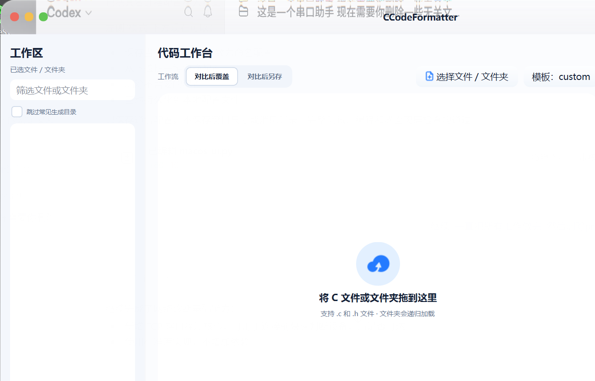

# CCodeFormatter

面向嵌入式 C 工程的桌面格式化与规范检查工具。它读取 `.c`、`.h` 文件及你的模板风格，先生成可查看的对比结果，再按选择写入原文件或另存输出。

## 界面预览



左侧管理待检查的文件与文件夹，中间显示格式化前后的代码对比，右侧提供检查、修复预览、导出和写入操作。界面效果可在无特效、液态玻璃与毛玻璃之间切换；全屏时会自动使用稳定模式。

## 功能

- 选择单个文件或文件夹，递归扫描 `.c`、`.h` 文件，并以可展开目录树展示。
- 根据模板统一缩进、括号、空格、`switch/case`、条件编译、宏定义、注释和 `do-while` 的换行风格。
- 保留源文件编码与换行符；覆盖前先生成对比，不会直接改写。
- 格式规范检查、问题搜索与点击定位；支持安全修复预览。
- WinMerge 风格的左右对比、差异缩略图、批量生成 `.formatted.c/.formatted.h` 文件和差异补丁导出。
- 差异块过多时自动进入轻量高亮模式，保留完整缩略图与导航，避免大文件对比卡顿。
- 自定义模板、多项目配置、最近选择与输出目录记忆。
- 提供无特效、液态玻璃、毛玻璃三种界面效果；全屏时自动使用稳定模式。

## 运行环境

- Windows 10/11
- Python 3.10+

安装依赖并启动：

```powershell
python -m venv .venv
.\.venv\Scripts\Activate.ps1
python -m pip install -e .
python main.py
```

也可以使用命令行：

```powershell
# 仅检查
python main.py --check path\to\source.c

# 默认生成 source.formatted.c，不覆盖原文件
python main.py path\to\source.c

# 指定输出位置
python main.py path\to\source.c --output path\to\formatted.c
```

## 模板

默认模板内置于程序。通过界面保存的自定义模板位于：

```text
C:\Users\<用户名>\AppData\Local\CCodeFormatter\profiles\custom\
```

其中 `template.c` 和 `template.h` 决定对应文件的格式风格。模板中的有效格式示例越完整，工具可识别的风格越准确。

## 打包 EXE

先创建虚拟环境并安装依赖，然后运行：

```bat
scripts\build_exe.bat
```

或者：

```powershell
.\scripts\build_exe.ps1 -OneFile
```

生成文件：

```text
dist\CCodeFormatter.exe
```

## 发布到 GitHub

仓库已配置 `origin`。双击以下文件后，输入提交说明、检查待发布文件并确认即可上传：

```text
scripts\publish_github.bat
```

命令行方式：

```bat
scripts\publish_github.bat -Message "修复格式化规则"
```

首次没有远端地址时，脚本会询问 GitHub 仓库 URL；首次推送会自动建立上游分支。脚本不会强制推送，也会阻止常见密钥和 `.env` 文件进入暂存区。

## 开发检查

```powershell
python -m compileall -q src tests
python -m unittest discover -s tests -q
```

## 常用快捷键

| 快捷键 | 功能 |
| --- | --- |
| `Ctrl+O` | 选择文件或文件夹 |
| `F5` | 重新检查工作区 |
| `Ctrl+Enter` | 生成当前文件对比 |
| `Ctrl+Shift+P` | 打开命令面板 |
| `Ctrl+0` | 恢复代码字体大小 |
| `Ctrl+Shift+0` | 恢复三栏工作区布局 |

## 目录说明

```text
src/ccf/       核心格式化、检查、模板、对比和界面代码
tests/         自动化测试
assets/        图标等程序资源
scripts/       打包与 GitHub 发布脚本
```
